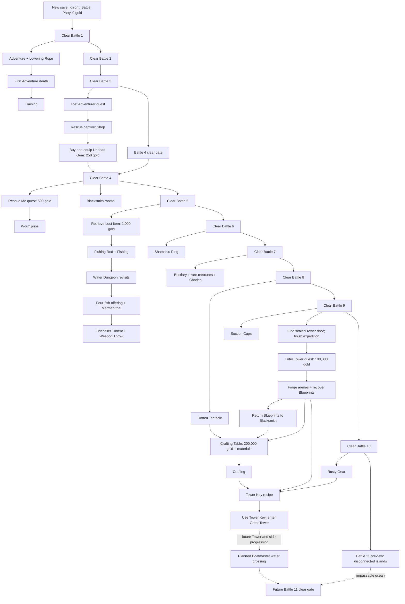

# Progression Unlock Tree

This is the canonical development map for NDB Idle progression. It records the
implemented opening from a new save through entering the Great Tower, plus the
deliberately blocked Battle 11 preview, including
mandatory convergence gates, optional NPC branches, activities, quest costs,
material dependencies, and one-time system unlocks.

Current code and tests remain the runtime source of truth. If an unlock changes,
this file must change in the same commit.

## Legend

- `→` is a direct unlock or required next step.
- `↳` is an optional branch.
- `+` means every listed input is required at the convergence point.
- **Available** means the player may select or encounter the content.
- **Clear gate** means the content can be entered but not completed without the
  named branch.
- Rings and internal quest IDs are development terms in this document, not
  player-facing prose.

## Main progression and convergence gates



The deliberately non-linear clear gate is:

1. Battle 4 becomes available after Battle 3, but the Skele-King remains
   invulnerable until a deployed member has the Shop's Undead Gem equipped.

Battle 8 has no Trident hard gate. Tidecaller Throw is a powerful ranged option,
while Worm's Acid Shot and ordinary attacks can also damage its Tentacles. The
Water branch is therefore optional rather than a hidden key.

## Full authored unlock tree

```text
New save
├── Navigation: Battle and Party
├── Selected screen: Battle
├── Party: Knight
├── Gold: 0
└── Battle 1 available
    └── Clear Battle 1 — Undertaker
        ├── Lowering Rope key item
        ├── Adventure navigation and activity
        │   ├── Immediate procedural rooms and systems
        │   │   ├── Gold, enemies, traps, springs, treasure, and equipment
        │   │   ├── `None` auto strategy for ordinary exploration and combat
        │   │   └── Lost Potionmaster may appear in earth ring 4
        │   └── First Adventure HP death
        │       └── Training navigation and gold training
        └── Battle 2 available
            └── Clear Battle 2 — Skeleton
                └── Battle 3 available
                    └── Clear Battle 3 — Skele-Prince
                        ├── Lost Adventurer quest obtained and activated
                        │   └── Marked earth ring-1 captive room
                        │       └── Defeat three Skeletons and talk to captive
                        │           ├── Shop unlocked
                        │           │   ├── Buy / Sell
                        │           │   ├── Level 1 Potions
                        │           │   ├── Inventory and stack upgrades
                        │           │   ├── Adventure supplies
                        │           │   │   ├── Visit ring 2 → Rope Level 1
                        │           │   │   ├── Visit ring 3 → Rope Level 2
                        │           │   │   └── Visit ring 4 → Rope Level 3
                        │           │   └── Undead Gem for 250 gold
                        │           └── Lost Adventurer completed
                        └── Battle 4 available
                            ├── Clear gate: deploy an equipped Undead Gem
                            └── Clear Battle 4 — Skele-King
                                ├── Lottery rooms enabled
                                ├── Blacksmith rooms enabled in earth ring 3
                                │   ├── Repeatable healing potion
                                │   │   └── Cost: 50 Clay
                                │   └── Retrieve Hammer branch
                                │       ├── Cost: 20 Clay
                                │       ├── Same-expedition Hammer Vault
                                │       └── Return Hammer
                                │           └── Buy Pickaxe
                                │               ├── 2,000 gold
                                │               ├── 20 Clay
                                │               └── 10 Driftwood
                                │                   └── Find Miner quest
                                │                       └── Give Pickaxe to Miner
                                │                           ├── Miner joins Party
                                │                           └── Mining navigation/activity
                                ├── Rescue Me Shop quest for 500 gold
                                │   └── Marked earth ring-2 cage room
                                │       └── Defeat seven Spiders and talk to Worm
                                │           ├── Worm joins the Party
                                │           ├── Together / Split Adventure strategy
                                │           └── Rescue Me completed
                                └── Battle 5 available
                                    └── Clear Battle 5 — Goblin Chief
                                        ├── Cartographer rooms enabled
                                        │   └── Visit three marked survey points
                                        │       └── Return to Cartographer
                                        │           ├── One Mapmaker's Chalk
                                        │           └── Cartographer room retires
                                        ├── Retrieve Lost Item Shop quest for 1,000 gold
                                        │   └── Marked earth ring-2 Water portal
                                        │       └── First Water Dungeon visit
                                        │           └── Meet Rodney in rooms 7–10
                                        │               ├── Fishing Rod
                                        │               ├── Fishing navigation/activity
                                        │               ├── Retrieve Lost Item completed
                                        │               ├── Expedition ejected
                                        │               ├── Water portals recur in earth ring 2
                                        │               ├── Angler branch enabled in Water
                                        │               │   ├── Deliver 10 Rat Pelts
                                        │               │   ├── Deliver 8 Ant Chitin
                                        │               │   ├── Deliver 4 Ink Sacs
                                        │               │   ├── Deliver one requested fish family
                                        │               │   └── Tackle Box
                                        │               │       └── Select a favored fish family
                                        │               └── Later Water visit: offering trial
                                        │                   ├── Offer four matching fish
                                        │                   └── Defeat three Mermen
                                        │                       ├── Tidecaller Trident
                                        │                       ├── Weapon Throw learned
                                        │                       └── Holder conserves fishing bait 20% of the time
                                        └── Battle 6 available
                                            └── Clear Battle 6 — Goblin Shaman
                                                ├── Shaman's Ring
                                                └── Battle 7 available
                                                    └── Clear Battle 7 — Beast Tamer
                                                        ├── Bestiary navigation
                                                        ├── Rare creatures in earth rings 1–2
                                                        │   ├── Frog → Eye of Frog
                                                        │   ├── Mutant Rat → Mutated Rat Tail
                                                        │   └── Fire Ant → Fire Ant Chitin
                                                        ├── Charles rooms enabled in earth ring 2
                                                        │   └── Deliver 10 of each rare material
                                                        │       ├── Three Level 1 Mystery Potions
                                                        │       └── Charles room retires
                                                        └── Battle 8 available
                                                            └── Clear Battle 8 — Abyssal Squid
                                                                ├── Rotten Tentacle
                                                                │   └── Reusable Fishing bait
                                                                │       ├── Driftwood chance
                                                                │       └── Seaweed chance
                                                                ├── Ring-target Adventure strategy
                                                                ├── Ignore-gold auto option
                                                                └── Battle 9 available
                                                                    └── Clear Battle 9 — Abyssal Ooze
                                                                        ├── Suction Cups
                                                                        ├── Level 2 Shop Potions
                                                                        ├── Dice rooms enabled
                                                                        ├── Tower Exterior may appear in earth ring 5
                                                                        │   └── Touch sealed Tower door
                                                                        │       └── Finish the expedition
                                                                        │           └── Enter Tower Shop quest available
                                                                        │               ├── Cost: 100,000 gold
                                                                        │               └── Marked earth ring-4 Forge portal
                                                                        │                   └── First Forge Dungeon
                                                                        │                       ├── Clear three arenas
                                                                        │                       ├── Forge enemies drop Rusty Metal
                                                                        │                       └── Recover Blacksmith's Blueprints
                                                                        │                           └── Return to Blacksmith
                                                                        │                               ├── Enter Tower quest completed
                                                                        │                               ├── Recurring Forge portals
                                                                        │                               └── Crafting Table offer
                                                                        │                                   ├── 200,000 gold
                                                                        │                                   ├── 20 Rusty Metal
                                                                        │                                   ├── 100 Clay
                                                                        │                                   └── 5 Seaweed
                                                                        │                                       └── Crafting navigation/activity
                                                                        └── Battle 10 available
                                                                            └── Clear Battle 10 — Rustmire Engine
                                                                                ├── Rusty Gear
                                                                                └── Battle 11 preview available
                                                                                    ├── 39×23 beach and island arena
                                                                                    ├── Every enemy island is disconnected from deployment
                                                                                    └── Clear blocked: no current water traversal

Tower entrance convergence
├── Crafting Table owned
├── Tower Key pattern known from the Forge
├── Six Rusty Metal available
├── Rusty Gear from Battle 10 available
└── Craft Tower Key
    └── Return to the sealed Tower door
        └── Use Tower Key
            └── Great Tower unlocked and current opening ends
```

## Battle 11 preview and planned convergence

Battle 11 is implemented as a visible future wall, not as a complete progression node.
Clearing Battle 10 exposes the western beach, distant islands, placeholder enemies, and
the Vacation Emperor. The arena cannot currently be cleared because ocean gaps separate
the entire party from every enemy.

Planned work before Battle 11 becomes a real clear includes additional Great Tower and
side-quest progression plus an early Boatmaster party member whose defining ability moves
characters across water gaps. Those future nodes are architectural intent only: they do
not yet exist in runtime state, Help, saves, or player-facing promises. Battle 11's enemy
numbers and reward must be rebalanced when those paths are implemented.

## Optional branch matrix

| Branch | First gate | Inputs | Permanent result |
| --- | --- | --- | --- |
| Training | First Adventure HP death | Gold per training purchase | Training navigation and stat levels |
| Lottery | Clear Battle 4 | Step on the room wheel | Repeatable gold-or-enemy rooms |
| Worm | Clear Battle 4, buy `Rescue Me` | 500 gold; clear marked room | Worm and multi-member strategies |
| Cartographer | Clear Battle 5 | Visit three survey marks | One consumable Mapmaker's Chalk |
| Fishing | Clear Battle 5, buy `Retrieve Lost Item` | 1,000 gold; reach Rodney | Fishing Rod, Fishing, Water revisits |
| Angler | Fishing Rod | 10 Rat Pelt, 8 Ant Chitin, 4 Ink Sac, one requested fish | Tackle Box and favored-family selection |
| Tidecaller | Fishing Rod and a later Water visit | Four requested fish; Merman fight | Trident, Weapon Throw, and 20% bait conservation while equipped |
| Charles | Clear Battle 7 | 10 Eye of Frog, 10 Mutated Rat Tail, 10 Fire Ant Chitin | Three Level 1 Mystery Potions |
| Lost Potionmaster | Reach earth ring 4 | 50 Rat Pelt, 50 Ant Chitin, 25 Ink Sac, 25 Fire Alligator Hide | Four random Level 2 Potions and 100 Magic Bait |
| Blacksmith healing | Clear Battle 4 and find Blacksmith | 50 Clay per purchase | Repeatable 200-HP Adventure consumable |
| Mining | Clear Battle 4; Hammer and Pickaxe branches | 20 Clay for Hammer quest; then 2,000 gold, 20 Clay, 10 Driftwood | Miner and Mining |
| Dice | Clear Battle 9 | Enter and roll | Repeatable dice rooms |
| Forge | Clear Battle 9; find Tower door; buy `Enter Tower` | 100,000 gold; clear three arenas | Blueprints, Rusty Metal source, recurring Forge portals |
| Crafting | Deliver Forge Blueprints | 200,000 gold, 20 Rusty Metal, 100 Clay, 5 Seaweed | Crafting navigation/activity |

## Critical material dependency paths

```text
Adventure Rat ───────────────> Rat Pelt ───────┬─> Angler
Adventure Ant ───────────────> Ant Chitin ─────┤
Water Octopus ───────────────> Ink Sac ────────┘

Rare Frog ───────────────────> Eye of Frog ────────┐
Rare Mutant Rat ─────────────> Mutated Rat Tail ───┼─> Charles
Rare Fire Ant ───────────────> Fire Ant Chitin ────┘   └─> Mystery Potions

Rat Pelt + Ant Chitin + Ink Sac + Fire Alligator Hide
  └─> Lost Potionmaster ──> Level 2 Potions + Magic Bait

Battle 8 ──> Rotten Tentacle ──> Fishing ──> Driftwood
                                      └─────> Seaweed
Driftwood + Clay + gold ──> Pickaxe ──> Miner ──> Mining

Forge enemies ──> Rusty Metal ────────────────┐
Battle 8 bait ──> Seaweed ────────────────────┼─> Crafting Table
Adventure ──────> Clay ───────────────────────┘

Forge enemies ──> six Rusty Metal ────────────┐
Battle 10 ──────> Rusty Gear ─────────────────┼─> Tower Key
Crafting Table ─> Crafting interface ─────────┘
```

## Ordering rules future work must preserve

- Only one purchased quest is active at a time. Buying another quest does not
  erase an existing active route.
- A first-clear reward is granted once; clearing a completed Battle is not part
  of normal progression.
- Locked navigation is absent, not shown disabled.
- Optional NPC rooms retire when their one-time objective is completed.
- A marked quest objective that is abandoned may be regenerated on a later run.
- Discovering the Tower door does not immediately expose its Shop quest. The
  current expedition must end first.
- `Enter Tower` recovers the Blacksmith's Blueprints; it does not open the
  Tower. The crafted Tower Key and a return to the door do that.
- The current implemented endpoint is entering the Great Tower with the key.
- Battle 11 may remain selectable beyond that endpoint while deliberately impossible.
  Do not make its islands reachable until the planned water-crossing branch exists.
